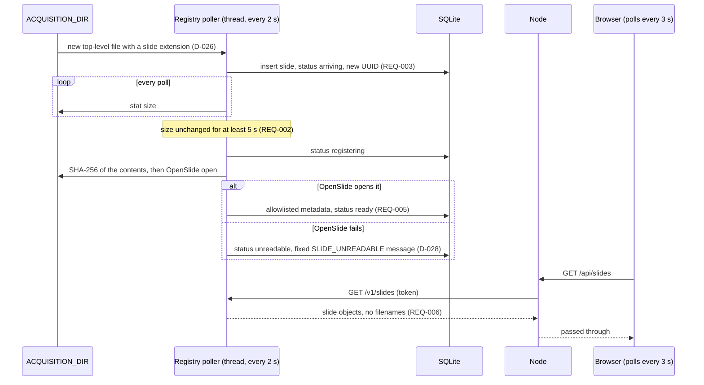
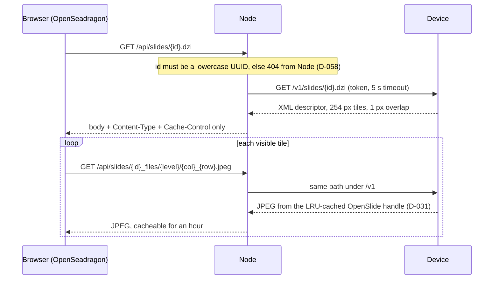
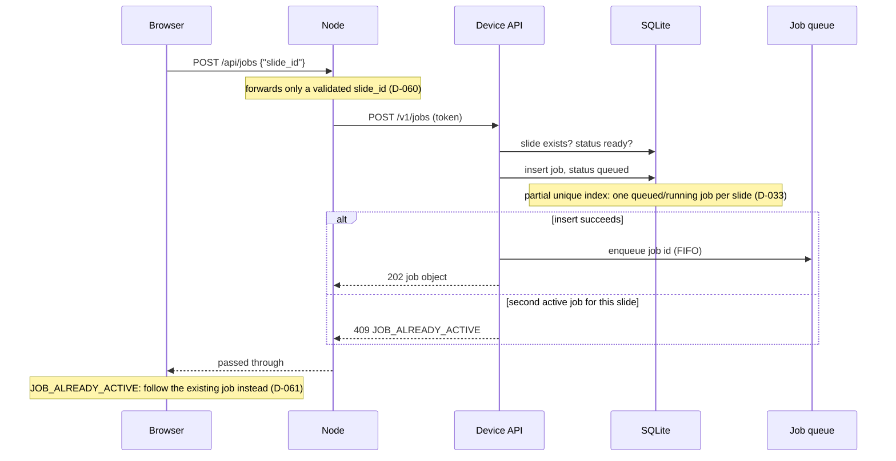
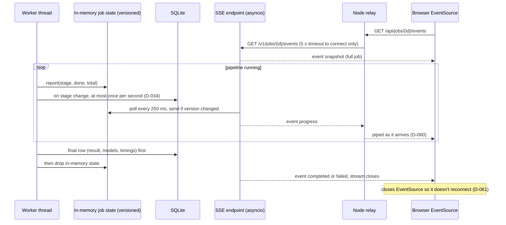
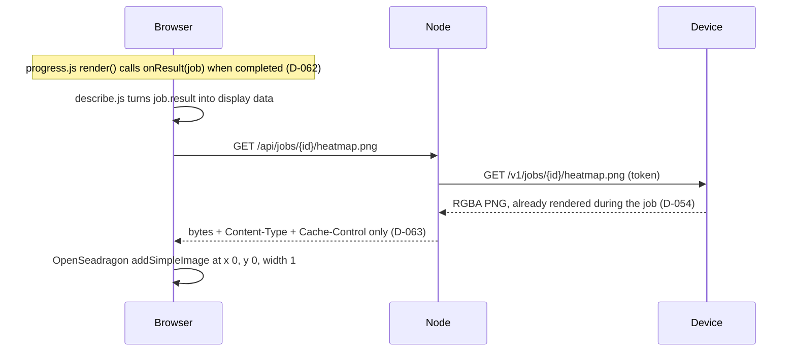

# Architecture - v0.1

How the system is put together, where each part runs, and what happens on
each path through it. The reasons behind each choice are in
`docs/decisions.md` (D-xxx). Payloads and error codes are in
`docs/api-contract.md`.

> Research demo only. Not for clinical use.

## 1. Components and where they run

```
 Mac (laptop)                                   Desktop (Windows 10 + WSL2, RTX 3090)
+--------------------------------------+       +------------------------------------------------+
| Browser                              |       | Inference service ("the device")               |
|  plain JS ES modules + OpenSeadragon |       |  FastAPI + Uvicorn, Python 3.12, uv            |
|  calls only /api/... on Node         |       |                                                |
|            |  HTTP, localhost        |       |  auth middleware (X-Device-Token)              |
|            v                         |       |  routes: health, slides, tiles, jobs, SSE      |
| Web app (Node 24 + Express 5)        |       |  registry poller thread --+                    |
|  server/deviceClient.js  ------------+-------+->                         |  SQLite (WAL)     |
|  the only code that calls the device | Tail- |  job worker thread -------+                    |
|  adds X-Device-Token, 5 s timeout    | scale |   pipeline: segment, patch, extract features,  |
|  listens on 127.0.0.1:3000           | (WG)  |   aggregate, render  -> GPU (PyTorch, CUDA)    |
+--------------------------------------+       |                                                |
                                               |  ACQUISITION_DIR  (slides arrive here)         |
                                               |  DATA_DIR         (SQLite, cache, job outputs) |
                                               |  models/weights   (pinned, hash-checked)       |
                                               +------------------------------------------------+
```

| Component | Runs on | Technology | Role |
|---|---|---|---|
| Inference service | Desktop, inside WSL2 | Python 3.12, FastAPI, Uvicorn, PyTorch (CUDA), OpenSlide, OpenCV, NumPy, SQLite | The "device". Watches the acquisition folder, owns slides, models and job state, runs the GPU pipeline, serves tiles, results and heatmaps over the versioned `/v1` API |
| Web server | Mac | Node 24, Express 5 | Serves the browser client and mediates every call to the device (D-003). Holds no slide or job state of its own |
| Browser client | Mac (same machine as the web server) | Plain JavaScript ES modules, OpenSeadragon 6.1.1 | Slide list, viewer, start analysis, live progress, results panel, heatmap overlay, error display |

The two machines are joined by Tailscale. The browser and the Node server
run on the same Mac, so Node listens on `127.0.0.1` only (D-056).

### Inference service modules (`services/inference/app/`)
| Module | Responsibility |
|---|---|
| `main.py` | `create_app()`: reads config, verifies and loads both models (refuses to start on a hash mismatch, D-049), builds the job queue; the lifespan starts the registry poller and the job worker |
| `config.py` | Settings from environment variables in a frozen dataclass; fails fast on a missing or short token (D-022) |
| `auth.py` | Pure ASGI middleware: deny by default, constant-time token comparison, only `/v1/health` is public (D-023) |
| `errors.py` | Error codes and the `{"error": {"code", "message"}}` shape; 500s never carry exception text (D-024) |
| `health.py`, `gpu.py` | `GET /v1/health`: GPU, model versions and hashes, queue depth |
| `registry.py` | Polls `ACQUISITION_DIR` every 2 s, waits for a stable size, hashes, reads allowlisted metadata (D-006, D-026) |
| `slides.py` | `GET /v1/slides`, `GET /v1/slides/{id}`: allowlisted fields only |
| `tiles.py` | Deep Zoom descriptor and tiles via OpenSlide's `DeepZoomGenerator`; 4-entry LRU of open slides (D-030, D-031) |
| `db.py` | `sqlite3`, one short-lived connection per operation, WAL mode (D-027) |
| `jobs.py` | FIFO queue, one worker thread, versioned in-memory progress, throttled SQLite writes, startup `INTERRUPTED` sweep (D-005, D-034, D-037) |
| `jobs_api.py` | `/v1/jobs` routes, the SSE progress stream, the heatmap PNG |
| `models.py` | Manifest, SHA-256 check, TorchScript loading, `.eval()` (D-040, REQ-016, REQ-020) |
| `pipeline/` | The stages the worker runs: `segment.py`, `patch.py`, `features.py`, `mil.py`, `heatmap.py`, `quality.py`, the feature `cache.py`, and `mil_pipeline.py`, which ties them together and maps failures to error codes |
| `scripts/fetch_models.py` | One-off weight download from the pinned revisions with hash check, standard library only (D-041) |

### Web app modules (`apps/web/`)
| Module | Responsibility |
|---|---|
| `server/index.js` | Express app: static client, `/vendor/openseadragon/` from `node_modules` (D-059), route mounting, final error handler |
| `server/config.js` | `INFERENCE_URL`, `DEVICE_TOKEN`, `PORT` from `.env` (loaded by Node's `--env-file`) |
| `server/deviceClient.js` | The only module that calls the device: token header, 5 s timeout, `DEVICE_OFFLINE` / `BAD_GATEWAY` / pass-through error mapping (D-057, D-058) |
| `server/ids.js` | `isUuid`: IDs are checked before any device URL is built |
| `server/raw.js` | `sendRaw`: device bytes to the browser with only `Content-Type` and `Cache-Control` |
| `server/errors.js` | `sendError`, `sendNotFound`, invalid JSON to `400 BAD_REQUEST` |
| `server/routes/` | `health.js`, `slides.js` (list, `.dzi`, tiles), `jobs.js` (start, list, get, SSE relay, heatmap) |
| `client/js/api.js` | `getJson` / `postJson`; never throws, returns `{ok, body}`; the browser's only `fetch` |
| `client/js/main.js` | Wires the parts together; health check, offline banner, model list |
| `client/js/slideList.js` | Polls `/api/slides` every 3 s, renders on change, keeps the selection (D-059) |
| `client/js/viewer.js` | One OpenSeadragon viewer; slide and heatmap overlay (D-063) |
| `client/js/progress.js` | Newest job per slide, `EventSource` follow, recovery after reload (D-061) |
| `client/js/results.js` | Draws the results panel |
| `client/js/describe.js`, `messages.js` | No DOM code: result to display data, and one message per error code (D-062) |

## 2. Data ownership

The device is the single source of truth (D-004). Node and the browser hold
nothing durable.

| Data | Where | Owner | Leaves the device? |
|---|---|---|---|
| Slide files | `ACQUISITION_DIR` (WSL2 filesystem, D-007) | Device | Never as files. Only Deep Zoom tiles (JPEG) and allowlisted metadata |
| Slide registry, jobs, results | `DATA_DIR/*.sqlite` (schema in the contract) | Device | As JSON slide and job objects; `file_path` is never served |
| Feature cache | `DATA_DIR/cache/<key>/` (`coords.npy`, `features.npy`) | Device | Never |
| Job outputs | `DATA_DIR/jobs/<job_id>/` (`coords.npy`, `attention.npy`, `mask.npy`, `heatmap.png`) | Device | Only `heatmap.png` |
| Model weights | `services/inference/models/weights/` (gitignored) | Device | Never. Names, revisions and hashes only |
| Live progress | In memory in the device's job queue | Device | Through the SSE stream |
| Selected slide | `#slide=<id>` URL fragment | Browser | No; it is only used to ask the device again after a reload (D-061) |
| Last slide list | In memory in `slideList.js` | Browser | No; it is a cache for change detection, replaced on every poll |

None of slides, weights, `.env` files, SQLite databases or feature caches
are committed to the repository.

## 3. Request flows

### 3.1 Slide arrival
Nobody calls anything: a file copied into the acquisition folder is picked
up by the registry poller. The browser sees it on its next list poll.



If the file changes while it is being hashed, it goes back to `arriving`
and the wait starts again.

### 3.2 Viewing a slide (tiles)

Tiles are generated with `limit_bounds=False`, so the Deep Zoom image is
exactly the level-0 image. That is what lets the heatmap sit at `(0, 0)`
with no offset (D-030).

### 3.3 Starting a job


### 3.4 Running a job and live progress
One worker thread takes jobs from the queue one at a time (REQ-008) and
runs the pipeline. Five stages are reported (REQ-010):

| Stage | What it does | Main library |
|---|---|---|
| `segmenting` | 2048 px thumbnail, HSV saturation, threshold 20, morphology (D-039, D-051) | OpenSlide, OpenCV |
| `patching` | 128 µm grid from the slide origin; keep patches whose centre is tissue; `NO_TISSUE` below 16 (D-043); `NO_RESOLUTION` without mpp (D-044) | NumPy |
| `extracting_features` | CTransPath on every patch, batch 64, 8 `DataLoader` workers (D-045); reports patches done of total; skipped on a cache hit (D-046) | PyTorch, Pillow |
| `aggregating` | Gated ABMIL: class probabilities and one attention score per patch | PyTorch |
| `rendering` | Heatmap PNG, uncertainty flag, quality metrics (D-053, D-054) | OpenCV, NumPy |



The "write the final row, then drop the in-memory state" order means that
whenever the in-memory state is missing, the SQLite row is final, so the
stream can never miss the end of a job (D-034).

If the browser closes the tab, `pipeline()` in Node closes the device
connection too. The job carries on; only the stream ends.

**Recovery after a browser refresh (REQ-104).** The selected slide is kept
in the URL fragment. On load, the browser asks the device for that slide's
newest job (`GET /api/jobs?slide_id=`) and, if it is still queued or
running, opens its event stream. The first event is a full snapshot, so
the progress bar is correct at once. This is the same code path as
clicking a slide, with nothing stored in the browser (D-061).

### 3.5 Results and heatmap

The PNG covers exactly the level-0 rectangle, and the slide is one
viewport unit wide in OpenSeadragon, so `x: 0, y: 0, width: 1` lines the
heatmap up with the tissue. Hiding it sets opacity 0. A counter discards a
PNG that finishes loading after the user has moved to another slide.

The heatmap colours are relative to each slide (1st to 99th percentile of
its attention scores): **a negative slide has red areas too**. The note
under the legend says so: "Not a probability of metastasis" (D-053).

The uncertainty and segmentation-suspect flags are computed once, on the
device. The browser only shows them (REQ-012, REQ-021, D-062).

### 3.6 Startup and shutdown
- **Startup:** config is read (fails on a missing or short token), both
  model files are hashed against `models/manifest.json` and loaded in
  `.eval()` mode. On a missing or mismatched file the process exits
  (REQ-016, REQ-020). Then any job left `queued` or `running` is marked
  `failed` with `INTERRUPTED` (REQ-009), and the poller and worker
  start.
- **Shutdown:** Uvicorn is run with `--timeout-graceful-shutdown 5` so
  open SSE streams don't block Ctrl+C. The running job stops at its next
  progress report and is marked `INTERRUPTED`. Feature-extraction worker
  processes ignore SIGINT so they don't fail the job first (D-037, D-052).
- **Nothing is retried automatically** (REQ-017, D-012). The user starts a
  new job.

## 4. Network boundary and security

```
Browser --(localhost)--> Node :3000 --(Tailscale, WireGuard)--> Device :8000 (Tailscale IP only)
          /api/* only              X-Device-Token header           /v1/*
```

- **Private network.** The device binds to its own Tailscale address
  inside WSL2 (`--host $(tailscale ip -4)`), not `0.0.0.0`. Nothing is
  exposed on the LAN or the internet. Tailscale runs inside WSL2 because
  Windows 10 has no mirrored networking (D-017, D-055).
- **Shared token.** Every `/v1` request except `GET /v1/health` must carry
  `X-Device-Token`. The check is deny by default, so a new route is
  protected without opting in, and unknown paths get `401`, not `404`.
  The comparison is constant time. Swagger UI and ReDoc are off (D-023,
  REQ-019).
- **One gateway.** The browser never sees the device's address or token.
  Only `deviceClient.js` calls the device (D-003, REQ-108). Tests check
  that no client file mentions the device API.
- **Narrow proxy.** Node checks every ID is a lowercase UUID and every tile
  path is numeric before building a device URL, forwards only `slide_id` in
  a job request, and copies only `Content-Type` and `Cache-Control` from
  binary device responses (D-058, D-060).
- **What the token does not do.** It is a single shared secret with no
  users, roles or expiry. That is enough for a two-machine demo on a
  private tailnet, not for anything more (authentication is out of scope
  for v0.1).

### PHI controls (REQ-004 to REQ-006, D-009)
Real slide files can carry patient identifiers in their label and macro
images, their metadata and their file names. The service prevents these
from leaving the device; it does not remove them from the file.

| Control | Where |
|---|---|
| Associated images (label, macro) are never read or served | Registry and tiles never call `associated_images`; a test greps the source for it |
| Only allowlisted metadata (dimensions, level count, mpp) is stored and served | `registry.read_metadata`, slide response model |
| No file names or paths in responses or logs | IDs are UUIDs; `file_path` is internal; errors and logs carry exception types, not exception text, including Uvicorn's own error log (D-024, D-028) |
| No text chunks in heatmap PNGs | OpenCV PNG encoding |
| No file names in the UI | Slides are labelled by the first 8 characters of their ID, size and detection time (D-059) |

## 5. Failure modes

Every failure ends in one of the codes in `docs/api-contract.md`, and every
code has one plain-language message in `client/js/messages.js`, which ends
with the code itself (D-062). Nothing retries automatically, except that the
browser keeps polling and re-asking (see below).

### Device and network
| Failure | Detected by | Code | What the user sees |
|---|---|---|---|
| Device not running, WSL asleep, Tailscale down | `deviceClient.js`: connection refused or DNS failure | `503 DEVICE_OFFLINE` | On page load: the offline banner. Later: the slide-list line "Can't refresh the list (DEVICE_OFFLINE)" with the last known list kept |
| Device reachable but not answering (half-dead tailnet path) | `deviceClient.js`: 5 s timeout | `503 DEVICE_OFFLINE` | As above, after 5 s instead of hanging (REQ-107) |
| Something else answering at `INFERENCE_URL` | Success status but not JSON | `502 BAD_GATEWAY` | Banner or status line telling the user to check `INFERENCE_URL` |
| Device returns an error that isn't the contract shape | `deviceClient.js` | `INTERNAL_ERROR` with the device's status | Generic message with the code |
| Node server not running | `api.js` in the browser: `fetch` rejected or non-JSON | `WEB_SERVER_OFFLINE` | Message to start the Node server |
| Wrong or missing token (misconfigured `.env`) | Device auth middleware | `401 UNAUTHORIZED` | "Check that DEVICE_TOKEN is the same on both machines". `/api/health` still succeeds, because `/v1/health` is public; the slide list fails |
| Event stream drops while a job runs | `EventSource` `error` event | (none) | "Connection lost. Reconnecting..." while the browser reconnects; if Node answers with an error instead, "Can't reach the analysis device. Retrying..." and the whole lookup is retried every 3 s (D-061) |

### Slides
| Failure | Detected by | Code | What the user sees |
|---|---|---|---|
| File still copying | Registry size-stability check | (status `arriving`) | Listed as arriving, not selectable |
| File OpenSlide can't open | Registry | status `unreadable`, `SLIDE_UNREADABLE` | Listed as unreadable with the message; not selectable |
| File removed or broken after registration | Tile read or job | `409 SLIDE_UNREADABLE` | Tile or job error (the list still shows it as ready, D-029) |
| Tiles or job requested for a slide that isn't ready | Device | `409 SLIDE_NOT_READY` | Message with the code |
| Unknown slide or job, malformed ID or tile path | Device, or Node before forwarding | `404 NOT_FOUND` | Message with the code |

### Jobs
| Failure | Detected by | Code | What the user sees |
|---|---|---|---|
| Second start for a slide with an active job | Partial unique index | `409 JOB_ALREADY_ACTIVE` | No error: the UI follows the existing job |
| Fewer than 16 tissue patches | `patching` stage | `NO_TISSUE` | "Analysis failed" with the message |
| No microns per pixel | `patching` stage | `NO_RESOLUTION` | "Analysis failed" with the message |
| Slide can't be read mid-job | Any stage | `SLIDE_UNREADABLE` | "Analysis failed" with the message |
| Service stopped or crashed mid-job, or job still queued at shutdown | Shutdown path or the startup sweep | `INTERRUPTED` | "Analysis failed" with the message; start a new job |
| Anything else (GPU out of memory, bug) | Worker catch-all | `INFERENCE_FAILED` | "Analysis failed" with the message; no exception text (REQ-017) |
| Heatmap requested before the job completed | Device | `409 JOB_NOT_COMPLETED` | Not reachable from the UI in normal use (the overlay is only added for completed jobs) |

### Result-quality warnings (not failures)
A completed job can still be one the user shouldn't trust. These show as
warnings in the results panel, never as errors:

| Condition | Flag | Shown as |
|---|---|---|
| Predicted-class probability within [0.3, 0.7], both ends included | `uncertain` | Uncertainty warning with the probability and the band (REQ-012) |
| Tissue fraction above 0.6 | `quality.segmentation_suspect` | Warning that the background may have been analysed as tissue (REQ-021) |
| Job from before item 7 | `uncertain: null`, `quality: null` | Prediction with a note that the checks weren't run |

## 6. Testing approach
- **Inference service:** `uv run pytest` runs everywhere with small fake
  models (`tests/fakes.py`) and synthetic slides. Tests marked `models` or
  `slide` need the real weights and a real slide, and run on the desktop
  GPU only (D-048).
- **Web app:** `npm test` starts the real `server/index.js` as a child
  process against a fake device (`test/helpers.js`), so the tests exercise
  exactly what `npm start` runs (D-056). Pure modules (`describe.js`,
  `messages.js`) are imported directly. What only a browser can show
  (rendering, zooming, overlay alignment) is checked by hand.
- Every test that verifies a requirement names it (`test_req_004_...`,
  `req_107: ...`). The mapping is in `docs/requirements.md`.
